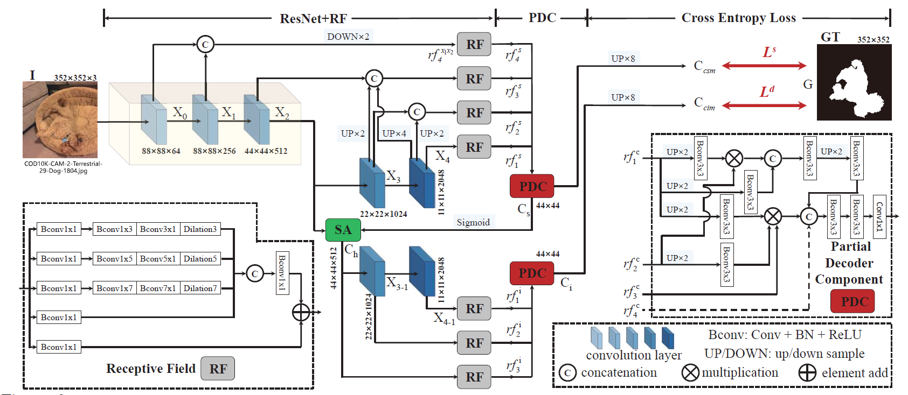
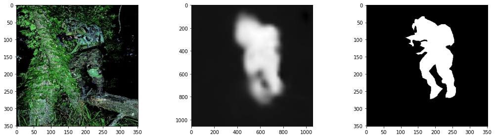
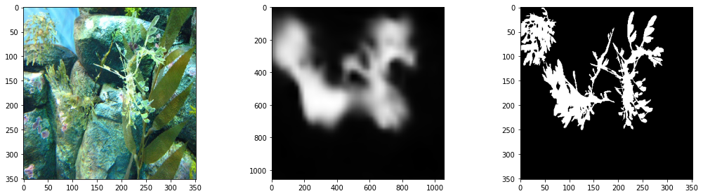

# Camouflaged Object Detection

## Team members
- Ismail Elomari Alaoui   A20497221

- Reda Chaguer            A20497223

## Project proposal
[Project Proposal](./doc/CS512___COD__Project_Proposal.pdf)

## Original research paper
[Reserach Paper Link](./doc/Fan_Camouflaged_Object_Detection_CVPR_2020_paper.pdf): https://openaccess.thecvf.com/content_CVPR_2020/papers/Fan_Camouflaged_Object_Detection_CVPR_2020_paper.pdf

```
@inproceedings{fan2020camouflaged,
  title={Camouflaged object detection},
  author={Fan, Deng-Ping and Ji, Ge-Peng and Sun, Guolei and Cheng, Ming-Ming and Shen, Jianbing and Shao, Ling},
  booktitle={Proceedings of the IEEE/CVF conference on computer vision and pattern recognition},
  pages={2777--2787},
  year={2020}
}
```

## Original implementation in PyTorch
[PyTorch Implementation Link](https://github.com/DengPingFan/SINet/)

## COD10k Dataset
[Full dataset COD10k](https://drive.google.com/file/d/1pVq1rWXCwkMbEZpTt4-yUQ3NsnQd_DNY/view)

Please use the following link to download the dataset (Recommended):
[Modified architecture dataset ZIP](https://drive.google.com/file/d/12QNmR6XJCaPqYtRCDLUwVSv46ugCZ1Uo/view?usp=sharing)

[Modified architecture dataset](https://drive.google.com/drive/folders/1LNfSPiGdct8jk99HUiOpV4cFctGP5kdV?usp=sharing)

## Network Architecture


## Report
[Report](./doc/CS512___COD__Project_Report.pdf)


## Presentation
[Presentation pptx](./presentation/CS512___COD__Project_Presentation.pptx)

[Presentation pdf](./presentation/CS512___COD__Project_Presentation.pdf)

## Usage
We used [Kaggle](./src/Notebooks/SINet_kaggle.ipynb) to train our model on the COD10k dataset. (Highly recommended as it is actually extremely faster than google colab Pro)

- Import the notebook on Kaggle, 

- Upload the recommended dataset above. 

- Zip this entire project's folder "COD_Project". 

- Upload it to kaggle too. You can then run the notebook to train the model and test it visually.

If you want to use Google colab Pro do the same as above. 
Make sure to change runtime to GPU and allow high memory usage.

A [google colab notebook](./src/Notebooks/SINet_colab.ipynb) is provided to help you with this.

## Trained model
[Trained model](https://drive.google.com/file/d/1TGgwjVN02OrZc9NUBdFK0byXc6x8G7ff/view?usp=sharing)

Import the libraries needed, and go directly the last cells on the notebook to test this trained model.
This model is the best one we could train, because we trained it for a long time (numerous epochs). 

## Sample outputs




