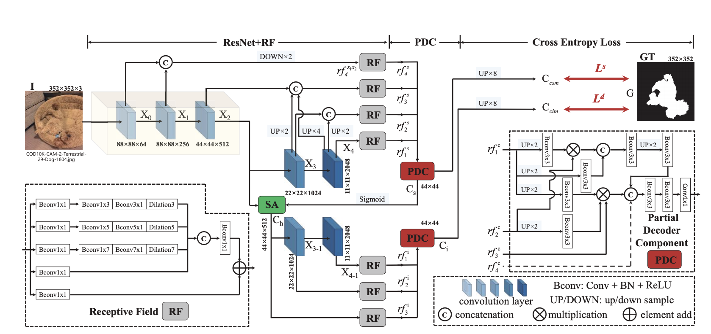
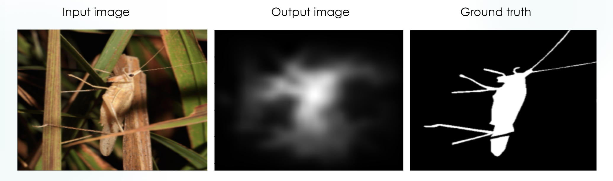
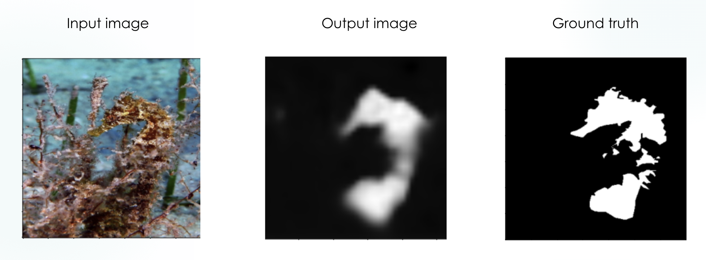

# Camouflaged-Object-Detection

This is a Tensorflow/Keras implementation of the SINet network described in [Camouflaged Object Detection](https://openaccess.thecvf.com/content_CVPR_2020/papers/Fan_Camouflaged_Object_Detection_CVPR_2020_paper.pdf)

## Original implementation in PyTorch may be found in: 
  [Camouflaged Object Detection - CVPR2020-Oral](https://github.com/DengPingFan/SINet/)

## Link to the database:
  [COD10k](https://drive.google.com/file/d/1pVq1rWXCwkMbEZpTt4-yUQ3NsnQd_DNY/view)
  
## Link to partially trained network:
  [Partially trained network](https://drive.google.com/file/d/1TpSfn9NjAkmbohi1sZx0n64TGVE0cCF-/view?usp=sharing) ( 500Mb )

## Network's Architecture:
 

# Usage:

## To train the model:
python3 src/train.py --images dataset/images --labels dataset/objects  

## Training arguments:
train.py [-h] --images IMAGES --labels LABELS [--epochs EPOCHS]
                [--batch-size BATCH_SIZE] [--save SAVE]
                [--check-path CHECK_PATH] [--visualize VISUALIZE]
                [--save-path SAVE_PATH]

## To test the network on a random sample of the validation set after the training use:
--test 1

## To retrain a model use:
--retrain 1 --retrain-path 'path_to_the_model'

## To visualize the losses after the training use:
--visualize 1

## Testing coming soon

# Preliminary results:

